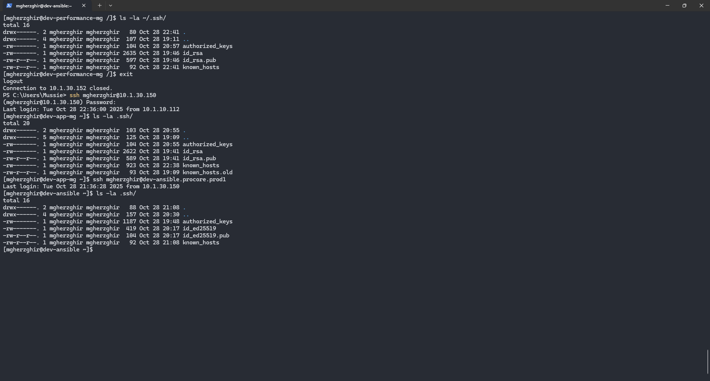

# Ansible

## Create and Copy your SSH key

**Description**

**[ TASK ] The security and network team is requesting that all users generate SSH keys to access the Ansible server and our GitLab repository.**
**[ OBJECTIVE ]** 
Improve secure access practices by configuring and troubleshooting SSH connections.`REQUIREMENTS:
1. Passwordless SSH authentication:
      dev-app <--> dev-ansible
      dev-app <--> GitLab account
      dev-performance <--> dev-ansible
      dev-performance <--> GitLab account`

**[ INFORMARTION ]**

1. Make sure you are login with your FreeIPA User when generating the key pair
2. Generate an ssh-key on your local dev servers and copy it to **dev-ansible.procore.prod1** which would help you ssh to ansible server without using a password.
3. Once login to **dev-ansible.procore.prod1** please generate an ssh-key and copy it to your **dev servers.**
4. Add your ssh-key (ida_rsa.public) to your **gitlab** profile
5. Please refer to the [wiki](http://10.1.10.122/?docs=procore-wike/viti-procore-howtoguides/generating-ssh-keys) if assistance is needed.

### My Work:

1. Log in using your FreeIPA username and password.
2. Generate an SSH key on your dev-app server and copy the public key to the Ansible client.
3. Repeat the process for the dev-performance server and copy the public key to the Ansible client.
4. Test and confirm that you can log in to the Ansible client without a password.
5. Log in to the Ansible client, generate a public key, and copy it to both dev-app and dev-performance.
    1. The Ansible client couldn't recognize the hostnames of dev-app and dev-performance.
    2. To resolve this, add the local hosts file on Ansible with the IP addresses and hostnames.
    3. Retry copying from the Ansible client to both dev-app and dev-performance using this syntax:`ssh-copy-id -i ~/.ssh/id_ed25519.pub mgherzghir@dev-performance-mg.procore.prod1`
6. Copy the public SSH keys from dev-app and dev-performance to GitLab.
7. Verify using this syntax:`ssh -T git@gitlab.com`
    
    Confirmation received.
    
    
    
    **My Road block solution**
    
    
    

## **Add Dev Servers into Ansible inventory**

**Description**

**[ TASK ] To perform automated actions on our infrastructure, please add your development servers to the Ansible inventory file.**
**[ OBJECTIVE ]** 
Practice infrastructure automation and orchestration using Ansible playbooks.`REQUIREMENTS:
1. Successful Ansible Ping Module testing:
      dev-ansible <--> dev-app ; dev-performance`
**[ INFORMATION ]** 
• Add your dev servers to the ansible server’s local DNS configurations (**/etc/hosts**)
• Create your own ansible group(**dev-[initials]**) in the inventory file
• Add your **dev-app-[initials].procore.prod1** **and dev-performance-[initials].procore.prod1** servers to the ansible inventory group you created (**dev-[initials]**). 
• Use the “ping” module command to test the connection from ansible server to your server.
• Please refer to the [wiki](http://10.1.10.122/?docs=procore-wike/configuration-management/what-is-ansible-and-how-does-it-work/) if you need more assistance.

Add your dev servers to the ansible server’s local DNS configurations (**/etc/hosts**)

Create your own ansible group(**dev-[initials]**) in the inventory file

Add your **dev-app-[initials].procore.prod1** **and dev-performance-[initials].procore.prod1** servers to the ansible inventory group you created (**dev-[initials]**).

Use the “ping” module command to test the connection from ansible server to your server.

Please refer to the [wiki](http://10.1.10.122/?docs=procore-wike/configuration-management/what-is-ansible-and-how-does-it-work/) if you need more assistance.

1. Add both my dev-app and dev-performance IPs to the local hosts DNS using Ansible.
2. Created inventory group called dev-mg
3. 


## 17. Patch your Dev Servers using Ansible

**Description**

**[ TASK ] In accordance with company policy, all development servers must be patched regularly. Please follow the instructions provided under Infrastructure Resources to patch your development servers using Ansible.**
**[ OBJECTIVE ]** 
Practice infrastructure automation and orchestration using Ansible playbooks.`REQUIREMENTS:
1. Successful Dev Server Patching using Ansible:
      dev-ansible --> dev-app ; dev-performance`
• Ensure that **python3** package is installed in your dev servers.
• Check out the sample patching template in creating your own playbook
    ◦ **/opt/ansible/patching/dev-patch.yml**
• Make sure you are able to patch your servers successfully!!

### My Work:

- I created a playbook based on the provided path example.
- I encountered an error stating that I needed to run sudo. Despite adding the -k option to prompt for the sudo password, I still received an error.
- Finally, I realized that I had used a lowercase -k instead of uppercase -K. After correcting this, the complete command to execute the playbook was:
- ansible-playbook dev-patch-mg.yml -K
    
    
    
    - I have open the template and only edited the hosts: dev-mg. The rest kept it default
        
        
        
        
        

## **Please use Ansible to create the task below.**

**Description**

**[ TASK ] The programmers on the webmasters team want to have a shared directory for collaboration on scripting knowledge for their division on all development servers.** 
**[ OBJECTIVE ]** 
Practice infrastructure automation and orchestration using Ansible playbooks.`REQUIREMENTS:
1. Successful Creation of Directory using Ansible:
      dev-ansible --> dev-app ; dev-performance
2. Directory Path: /opt/scripts/{yourusername}/
3. User: {yourusername}
4. Group: webmasters
5. Permission: 775`
**[ INFORMATION ]** 
• Create a directory called **/opt/scripts/{yourusername}/** on both of your servers using ansible.
• It should be owned by yourself as owner and **webmasters** as group. 
• Permission should be **775**.

Create a directory called **/opt/scripts/{yourusername}/** on both of your servers using ansible.

It should be owned by yourself as owner and **webmasters** as group.

Permission should be **775**.

### My work:

Created a playbook called web-mg.yml

this was configuration


Run the playbook


To confirm i have check both server


## **50. Create tasks using Ansible Playbook**

**Description**

**[ TASK ] Please create an ansible playbook that would perform below tasks on dev-app-[initials].procore.prod1-IP**
**[ OBJECTIVE ]** 
Practice infrastructure automation and orchestration using Ansible playbooks.`REQUIREMENTS:
1. VM: dev-app
2. Ansible playbook  
      a. Local user: tfleming
      b. Expire tfleming's password
      c. Install tmux`
**[ INFORMATION ]** 
• Create a local user named: tfleming
• Expire the tfleming's password
• And Install tmux

### My Work:

## **Login into ansible server**

1. firstly comment one of my inventory hostname in the group so that it can only target dev-app-mg
2. test the ping connection and was successful
3. edit my playbook according requirement
    
    
    
    - AT First the parameters failed when running ansible playbook
        
        
        
        - Found the root cause and solve the playbook
        
        
        
        
        

## **51. Closing these ports via an ansible playbook**

**Description**

**[ TASK ] Please create an Ansible playbook to close ports 80 and 443 on dev-app-[initials].procore.prod1-IP**
**[ OBJECTIVE ]** 
Practice infrastructure automation and orchestration using Ansible playbooks.`REQUIREMENTS:
1. VM: dev-app
2. Ansible playbook that closes ports 80 and 443`

### My Work:

When writing an Ansible playbook to close ports `80/tcp` and `443/tcp`, I kept getting the error:

```
absent and present state can only be used in zone level operations

```

Even though the syntax looked right, Ansible refused to process the task.

Port and Service Operations (Inside a Zone) do not use absent or present state

But instead they use enabled or disabled

The result after running the playbook.


The result after running the playbook.


## 1. Installation & Setup

Key steps you’d expect (based on the video and general best-practices):

1. Choose a control machine (often Linux).
2. Install Ansible (e.g., via `pip`, `apt`, `yum`, depending on OS).
3. Ensure target nodes are reachable (SSH connectivity, Python installed on node, etc.).
4. Create an inventory file listing hosts (or groups).
5. Configure Ansible settings (`ansible.cfg`) if customizing (e.g., remote user, SSH keys).
6. Test connectivity with an ad-hoc command (e.g., `ansible all -m ping`).
7. Begin writing playbooks to automate tasks.
    
    ## 2. Inventory & Ad-Hoc Commands
    
    - **Inventory file**: A plain text file (often INI or YAML) defining groups of hosts, e.g.:
        
        ```
        [webservers]
        web1.example.com
        web2.example.com
        
        [dbservers]
        db1.example.com
        
        ```
        
    - You can use variables per host or group.
    - **Ad-hoc commands**: Quick one-line commands to execute a module across hosts without a full playbook, e.g.:
        
        ```
        ansible webservers -m yum -a "name=httpd state=present"
        
        ```
        
    - Good for one-off tasks, testing connectivity, verifying modules.
    
    ## 3. Playbooks: Structure & Writing
    
    - Playbook is a YAML file, usually starting with `--` and containing one or more “plays”.
    - A play maps hosts → tasks. Example skeleton:
        
        ```yaml
        ---
        - name: Configure web servers
          hosts: webservers
          become: yes
          tasks:
            - name: Install Apache
              yum:
                name: httpd
                state: present
        
            - name: Ensure service is running
              service:
                name: httpd
                state: started
        
        ```
        
    - **Key components**:
        - `hosts`: the target group(s) from inventory.
        - `become`: escalate privileges (sudo) if needed.
        - `tasks`: list of tasks each using a module.
    - Use modules rather than raw shell commands for idempotence (i.e., running multiple times results in same state).
    - Variables, `when` conditionals, loops, handlers (for restart on change) are all concepts that build on this.
    
    [20251020-1550-57.4320008.mp4](Ansible/20251020-1550-57.4320008.mp4)
    

## Ansible Study Session Documentation

### 1. **Task Overview**

- **Objective:** Learn how to create an Ansible playbook to install Python3, install and start Apache, and understand how to manage services and reboots using Ansible modules.
- **Scope:** Development servers `dev-app` and `dev-performance`.
    
    ### 2. **Steps Taken**
    
    1. Verified Ansible installation on control node:
        
        ```bash
        ansible --version
        
        ```
        
    2. Confirmed inventory connectivity:
        
        ```bash
        ansible all -i /opt/ansible/inventory/dev -m ping
        
        #or
        
        ansible -m ping <inventoryfile.yml>
        
        ```
        
        ✅ Both servers responded with `pong`.
        
    3. Created a simple playbook snippet to install Python3:
        
        ```yaml
        - name: Install Python
          hosts: dev_mg
          become: yes
        
          tasks:
            - name: Ensure Python3 is installed
              ansible.builtin.yum:
                name: python3
                state: present
        
        ```
        
    4. Added tasks to install and start Apache:
        
        ```yaml
        - name: Install Apache
          ansible.builtin.yum:
            name: httpd
            state: present
        
        - name: Start and enable Apache
          ansible.builtin.service:
            name: httpd
            state: started
            enabled: yes
        
        ```
        
    5. Learned about **rebooting a server** using the module:
        
        ```yaml
        - name: Reboot server after patching
          ansible.builtin.reboot:
            msg: "Reboot initiated by Ansible after patching"
            reboot_timeout: 600
        
        ```
        
    6. Ran the playbook:
        
        ```bash
        ansible-playbook dev-patch-mg.yml -K
        
        ```
        
    7. Verified results:
        - Terminal output showed tasks as `ok` or `changed`
        - Confirmed server uptime using:
            
            ```bash
            ansible all -i /opt/ansible/inventory/dev -a "uptime"
            
            ```
            
    
    ---
    
    ### 3. **Challenges / Roadblocks**
    
    - Initially forgot to use `become: yes`, received permission errors.
    - Confusion about when to use the `K` flag.
    - Understanding the difference between package installation and service management modules.
    
    ---
    
    ### 4. **Resolution / Learnings**
    
    - Added `become: yes` to allow tasks to run with sudo.
    - Learned that `K` prompts for sudo password if passwordless sudo is not configured.
    - Clarified that:
        - `ansible.builtin.yum` / `ansible.builtin.apt` → install packages
        - `ansible.builtin.service` → manage service state
        - `ansible.builtin.reboot` → safely reboot servers
    - Understood the importance of **YAML indentation** and task structure.
    - Learned that `ok` vs `changed` shows idempotence: Ansible only changes what’s needed.
    
    ---
    
    ### 5. **Verification / Proof**
    
    - Screenshots captured:
        - Playbook run output showing `ok`/`changed` results
        - `uptime` command after reboot
    - Optional: brief video explanation describing tasks performed and results observed.
    
    ---
    
    ### 6. **Next Steps**
    
    - Practice building a full patching playbook that runs across multiple servers automatically.
    - Add **handlers** to restart services only if configuration changes.
    - Explore **conditional tasks** using `when:` and looping over multiple packages.
    
    ---
    
    If you want, I can also make a **one-page visual version** of this documentation with headings, code blocks, and notes ready to **attach as a Jira submission**, which is often easier for review
    
    ---
    
    vi /etc/ansibel/hosts # on ansible server
    
    